# SDMC - Sistema para Doação de Material de Construção


# Sumário


- [SDMC - Sistema para Doação de Material de Construção](#sdmc---sistema-para-doação-de-material-de-construção)
- [Sumário](#sumário)
- [1. Introdução](#1-introdução)
- [2. Descrição](#2-descrição)
  - [2.1. Requisitos.](#21-requisitos)
  - [2.2. Funcionais e não-funcionais](#22-funcionais-e-não-funcionais)
- [3. Diagramas](#3-diagramas)
  - [3.1. Diagrama de classe](#31-diagrama-de-classe)
    - [digrama feito no white star (versão 1)](#digrama-feito-no-white-star-versão-1)
    - [3.1.1. Descrição do Diagrama de classe:](#311-descrição-do-diagrama-de-classe)
  - [3.2. Diagrama ER](#32-diagrama-er)
  - [3.3. Diagrama de casos de uso](#33-diagrama-de-casos-de-uso)
    - [3.3.1. Exemplo 1](#331-exemplo-1)
    - [3.3.2. Exemplo 2](#332-exemplo-2)
  - [3.3. Diagrama de atividade](#33-diagrama-de-atividade)
  - [3.4. Diagrama de componentes](#34-diagrama-de-componentes)
  - [3.5. Diagrama de implantação](#35-diagrama-de-implantação)
  - [3.6. Diagramas C4](#36-diagramas-c4)
    - [3.6.1. Diagrama C4 de contexto.](#361-diagrama-c4-de-contexto)
    - [3.6.2. Diagrama C4 de contêiner](#362-diagrama-c4-de-contêiner)
    - [3.6.3. Diagrama C4 de componente](#363-diagrama-c4-de-componente)
    - [3.6.4. Diagrama C4 de código](#364-diagrama-c4-de-código)
  - [4. Histórias de usuário](#4-histórias-de-usuário)
    - [4.1. Organização de épicos e features](#41-organização-de-épicos-e-features)
      - [4.1.1. Épico 1: Gestão de Doadores](#411-épico-1-gestão-de-doadores)
      - [4.1.2. Épico 2: Gestão de Beneficiários](#412-épico-2-gestão-de-beneficiários)
      - [4.1.3. Épico 3: Operações Internas da Instituição](#413-épico-3-operações-internas-da-instituição)
      - [4.1.4. Épico 4: Gestão Financeira](#414-épico-4-gestão-financeira)
      - [4.1.5. Épico 5: Transparência e Comunicação](#415-épico-5-transparência-e-comunicação)
    - [4.2. Jornada do usuário](#42-jornada-do-usuário)
      - [4.2.1. Jornada do Usuário: Doador](#421-jornada-do-usuário-doador)
      - [4.2.2. Jornada do Usuário: Beneficiári](#422-jornada-do-usuário-beneficiári)
  - [5. Protótipo de telas](#5-protótipo-de-telas)
    - [5.1. Exemplo de telas elaboradas via prompt](#51-exemplo-de-telas-elaboradas-via-prompt)
  - [6. Diagrama de navegação de tela](#6-diagrama-de-navegação-de-tela)
  - [7. Pilha tecnológica](#7-pilha-tecnológica)
  - [8. Cronograma, Gráfico de Gantt](#8-cronograma-gráfico-de-gantt)
  - [9. Estimativa de custos](#9-estimativa-de-custos)
  - [10. Anexos](#10-anexos)
    - [10.1. Script SQL](#101-script-sql)
    - [10.2. Dados artificiais para testes de banco](#102-dados-artificiais-para-testes-de-banco)


# 1. Introdução

* Contexto: tarefa de casa...
* Motivação: tarefa de casa...


# 2. Descrição

Sistema para auxiliar no gerênciamento de uma instituição de caridade, que recebe doações de material de construção e direciona os mesmos para pessoas necessitadas previamente cadastradas.


## 2.1. Requisitos.

| Id | Requisitos |
|----|------------|
| 1  | Temos uma instituição sem fins lucrativos |
| 2  | A Instituição tem os seguintes atributos: nome, cnpj, localizaçao, cidade |
| 3 | A Instituição recebe Doação de Materias de construção |
| 4 | A Instituição tem um Depósito |
| 5 | A Instituição recebe Materiais do tipo: tijolo, cimento e telhas |
| 6 | A Instituição tem um Cadastro dos Materiais |
| 7 | A Instituição tem um Cadastro dos doadores |
| 8 | A Instituição tem um Cadastro dos Beneficiários |
| 9 | A Instituição tem um Depósito Temporário de Materiais de construção |
| 10 | A Instituição tem um banco de dados de Doadores, Materiais de construção e Beneficiários |
| 11 | A Instituição tem um pessoal de Staff, Estagiários e Voluntários; o Staff tem diretores e gerentes. |
| 12 | A Instituição tem um "contas a receber" e "contas a pagar", cuidado pela gerência contábil. |
| 13 | A Instituição tem um Regimento Interno (RI). |
| 14 | A Instituição atende apenas no horário da tarde, das 14hs as 18hs. |
| 15 | A Instituição recebe apenas Materais de construção usados na estrutura de casas, não recebe do tipo "materiais de interior" ou "materiais de acabamento". |
| 16 | A Instituição realiza uma Assembléia por ano, em março. |
| 17 | A Instituição realiza Campanhas com data, prazo, responsável e local previamente definidos|
| 18 | As Campanhas são para arrecadar determinados tipos de Materiais de construção como: telhas e tijolos. |
| 19 | Quando o depósito da Instituição esta cheio, os Materiais doados ficam com os Doadores temporariamente, até serem acionados para levar o Material ao Depósito da Instituição. |
| 20 | A Instituição tem um Controle de estoque indicando, qual Material entrou e quem fez a doação. |
| 21 | O controle de estoque indica onde esta armazenado temporariamente o Material até que sejam feita a destinação final deste. |
| 22 | O Controle de estoque também tem os dados de qual Beneficário recebeu os Materiais de contrução, em qual data e hora. |
| 23 | A Instituição tem um caminhão e uma pickup S10. |
| 24 | A Instituição usa o caminhão e a pickup para fazer entregas de materiais de construção, do depósito até os Beneficiários. |
| 25 | Uma ação de doação de Materiais de construção deve ter uma data e hora, previamente agendada com a equipe da Instituição e o Beneficiário. |
| 26 | A Instituição deverá ter um seu Site Institucional uma lista de doares, calendário de doação, datas de assembléis, redimento interno, lista de Beneficionários e formuláiros para os que desejarem doar ou receber materiais de construção. |
| 27 | O Beneficiário deverá apresentar declaração de rendimento ou outro documento equivalente que indique sua situação. |

[Voltar ao início](#sumário)

## 2.2. Funcionais e não-funcionais

> [!TIP]
> Faça uma tabela usando Markdown, com duas colunas, uma coluna indicando o requisito e a outra coluna indicando o tipo de requisito (como "Funcional" ou "Não funcional"), para esta tarefa use a lista abaixo:


| Requisito                                                                                         | Tipo de Requisito |
|---------------------------------------------------------------------------------------------------|-------------------|
| Temos uma instituição sem fins lucrativos                                                        | Funcional         |
| A Instituição tem os seguintes atributos: nome, cnpj, localização, cidade                          | Funcional         |
| A Instituição recebe Doação de Materiais de construção                                            | Funcional         |
| A Instituição tem um Depósito                                                                     | Funcional         |
| A Instituição recebe Materiais do tipo: tijolo, cimento e telhas                                  | Funcional         |
| A Instituição tem um Cadastro dos Materiais                                                       | Funcional         |
| A Instituição tem um Cadastro dos doadores                                                        | Funcional         |
| A Instituição tem um Cadastro dos Beneficiários                                                   | Funcional         |
| A Instituição tem um Depósito Temporário de Materiais de construção                               | Funcional         |
| A Instituição tem um banco de dados de Doadores, Materiais de construção e Beneficiários           | Funcional         |
| A Instituição tem um pessoal de Staff, Estagiários e Voluntários; o Staff tem diretores e gerentes | Funcional         |
| A Instituição tem um "contas a receber" e "contas a pagar", cuidado pela gerência contábil        | Funcional         |
| A Instituição tem um Regimento Interno (RI).                                                      | Funcional         |
| A Instituição atende apenas no horário da tarde, das 14hs as 18hs                                 | Não Funcional     |
| A Instituição recebe apenas Materiais de construção usados na estrutura de casas, não recebe do tipo "materiais de interior" ou "materiais de acabamento" | Não Funcional     |
| A Instituição realiza uma Assembleia por ano, em março.                                           | Não Funcional     |
| A Instituição realiza Campanhas com data, prazo, responsável e local previamente definidos         | Funcional         |
| As Campanhas são para arrecadar determinados tipos de Materiais de construção como: telhas e tijolos | Funcional         |
| Quando o depósito da Instituição está cheio, os Materiais doados ficam com os Doadores temporariamente, até serem acionados para levar o Material ao Depósito da Instituição | Funcional         |
| A Instituição tem um Controle de estoque indicando, qual Material entrou e quem fez a doação      | Funcional         |
| O controle de estoque indica onde está armazenado temporariamente o Material até que sejam feita a destinação final deste | Funcional         |
| O Controle de estoque também tem os dados de qual Beneficiário recebeu os Materiais de construção, em qual data e hora | Funcional         |
| A Instituição tem um caminhão e uma pickup S10                                                   | Funcional         |
| A Instituição usa o caminhão e a pickup para fazer entregas de materiais de construção, do depósito até os Beneficiários | Funcional         |
| Uma ação de doação de Materiais de construção deve ter uma data e hora, previamente agendada com a equipe da Instituição e o Beneficiário | Funcional         |
| A Instituição deverá ter em seu Site Institucional uma lista de doadores, calendário de doação, datas de assembleias, regimento interno, lista de Beneficiários e formulários para os que desejarem doar ou receber materiais de construção | Funcional         |
| O Beneficiário deverá apresentar declaração de rendimento ou outro documento equivalente que indique sua situação | Não Funcional     |


[Voltar ao início](#sumário)


# 3. Diagramas

## 3.1. Diagrama de classe


O diagrama de classes, um dos principais diagramas da UML (Unified Modeling Language), serve para representar a estrutura estática de um sistema orientado a objetos, descrevendo suas classes, atributos, métodos e os relacionamentos entre elas, como herança, associação, agregação e composição. Ele é fundamental durante a fase de análise e design, pois permite visualizar como os objetos do sistema interagem, favorecendo a compreensão, a reutilização de código e a manutenção da arquitetura do software.


### digrama feito no white star (versão 1)


**Exemplo 1**


> [!TIP]
> Faça um diagrama de classe usando Markdown e Mermaid, para os requisitos abaixo:

**Exemplo 2**

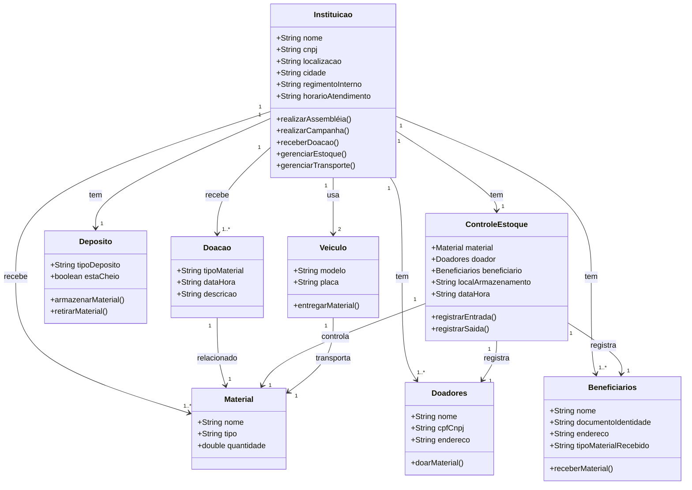


[Voltar ao início](#sumário)


### 3.1.1. Descrição do Diagrama de classe:

Instituicao é a classe principal, representando a entidade que administra a organização, que possui atributos como nome, CNPJ, localização, etc.

Doacao é a classe que representa as doações de materiais feitas para a instituição.

Deposito representa os depósitos (temporários e permanentes) de materiais.

Material armazena os diferentes tipos de materiais, como tijolos e telhas.

Doadores e Beneficiarios são as classes que representam as pessoas que doam e aquelas que recebem os materiais, respectivamente.

ControleEstoque é a classe que gerencia o controle do estoque, registrando entradas e saídas de materiais.

Veiculo refere-se aos veículos utilizados pela instituição para transportar materiais.

[Voltar ao início](#sumário)

## 3.2. Diagrama ER


O diagrama Entidade-Relacionamento (DER) é utilizado para modelar a estrutura lógica de um banco de dados, representando entidades (tabelas), atributos (colunas) e os relacionamentos entre essas entidades. Ele permite visualizar de forma clara como os dados estão organizados, quais conexões existem entre diferentes conjuntos de dados e quais são as regras de integridade, como cardinalidade e dependência. O DER é essencial na fase de projeto de banco de dados, facilitando a criação de esquemas eficientes, consistentes e alinhados aos requisitos do sistema.


> [!TIP]
> Faça um diagrama de Entidade Relacionamento usando Markdown e Mermaid, para os requisitos abaixo:


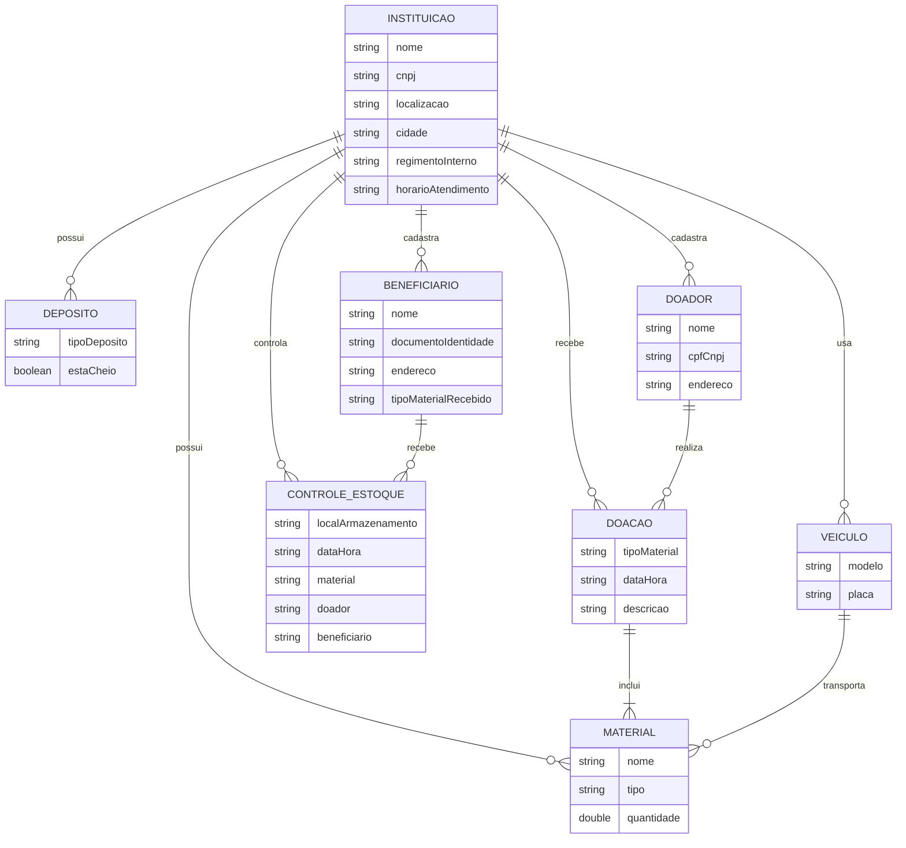

[Voltar ao início](#sumário)


## 3.3. Diagrama de casos de uso

O diagrama de casos de uso é utilizado para representar, de forma simples e visual, as funcionalidades que um sistema deve oferecer sob a perspectiva dos usuários (atores), descrevendo as interações entre esses atores e os diferentes casos de uso (funcionalidades ou serviços). Ele é essencial na fase de levantamento e especificação de requisitos, pois ajuda a esclarecer o que o sistema deve fazer, sem entrar em detalhes técnicos, promovendo uma comunicação eficiente entre desenvolvedores, analistas e partes interessada.


> [!TIP]
> Faça um diagrama de Casos de Uso usando Markdown e PlantUML, para os requisitos abaixo:

<!--
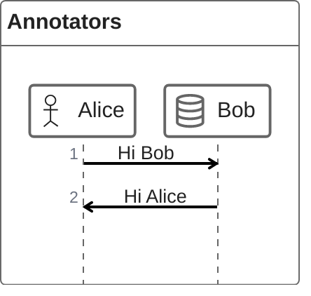
-->

### 3.3.1. Exemplo 1

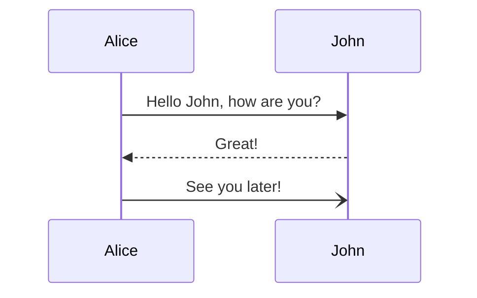

[Voltar ao início](#sumário)

### 3.3.2. Exemplo 2


> [!TIP]
> Dica para incluir um incluir o digrama feito no white star ! [ ] ( )

## 3.3. Diagrama de atividade


O diagrama de atividades é utilizado para modelar o fluxo de controle ou de atividades dentro de um sistema, representando processos, decisões, paralelismos e sequências de ações. Ele é especialmente útil para descrever logicamente como uma funcionalidade é executada, seja em um processo de negócio ou em um algoritmo, permitindo visualizar caminhos alternativos, ramificações e condições. Muito empregado em análise de requisitos e modelagem de processos, esse diagrama facilita a compreensão e validação do comportamento do sistema por todos os envolvidos no projeto.


<!--
ou flowchart

incluir o digrama feito no white star

-->

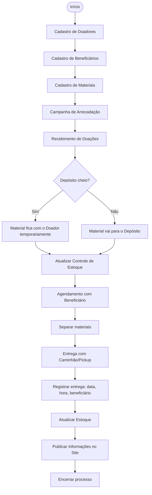

[Voltar ao início](#sumário)

## 3.4. Diagrama de componentes


O diagrama de componentes é utilizado para representar a organização e a dependência entre os módulos de software (componentes) em um sistema, mostrando como eles estão estruturados e como se comunicam por meio de interfaces. Ele é essencial para a modelagem da arquitetura lógica do sistema, especialmente em projetos de média e grande escala, pois permite visualizar a divisão em partes reutilizáveis, facilitando o entendimento da modularidade, da manutenção e da integração entre diferentes partes do software.


<!--
use plantuml
-->

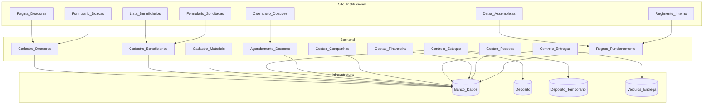

[Voltar ao início](#sumário)


## 3.5. Diagrama de implantação


O diagrama de implantação serve para representar a arquitetura física de um sistema, mostrando como os componentes de software são distribuídos entre os nós de hardware (servidores, dispositivos, redes), além das conexões entre esses elementos. Ele é fundamental para visualizar a infraestrutura necessária para executar o sistema, evidenciando aspectos como servidores, bancos de dados, dispositivos móveis e a comunicação entre eles. Esse diagrama é especialmente útil nas fases de planejamento da infraestrutura, implantação e manutenção de sistemas distribuídos ou baseados em nuvem.


<!--
use plantuml

@startuml
!define DeploymentUML
-->


[Voltar ao início](#sumário)


## 3.6. Diagramas C4

### 3.6.1. Diagrama C4 de contexto.

O diagrama C4 de contexto, primeiro nível da abordagem C4 (Context, Container, Component, Code), serve para fornecer uma visão geral de alto nível de um sistema, mostrando como ele se encaixa no ambiente em que está inserido. Ele representa os principais atores (usuários, sistemas externos) que interagem com o sistema em questão, bem como os fluxos de informações e relações entre eles. Esse diagrama é ideal para comunicação com stakeholders não técnicos, pois foca no "quê" e "quem" sem detalhar implementações, facilitando o entendimento dos limites e objetivos do sistema.


<!--
C4 System Context Diagram (C4Context)
-->

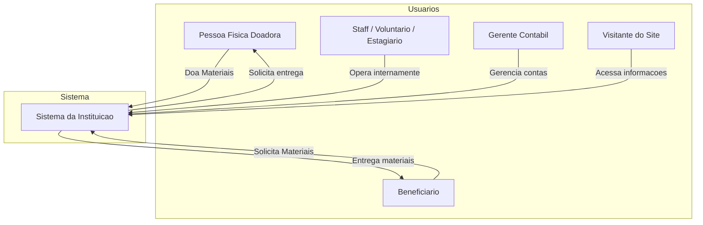
[Voltar ao início](#sumário)

### 3.6.2. Diagrama C4 de contêiner


O diagrama C4 de contêiner, segundo nível da abordagem C4, serve para detalhar a arquitetura interna de um sistema ao mostrar os principais contêineres de software que o compõem — como aplicações web, serviços, bancos de dados e APIs — e como esses contêineres se comunicam entre si e com os usuários externos. Ele ajuda a entender como o sistema está dividido logicamente em partes executáveis e implantáveis, revelando responsabilidades, tecnologias utilizadas e interações. Esse diagrama é especialmente útil para arquitetos e desenvolvedores planejarem a estrutura técnica e a distribuição dos serviços dentro do sistema.


<!--
C4 Container diagram (C4Container)
-->

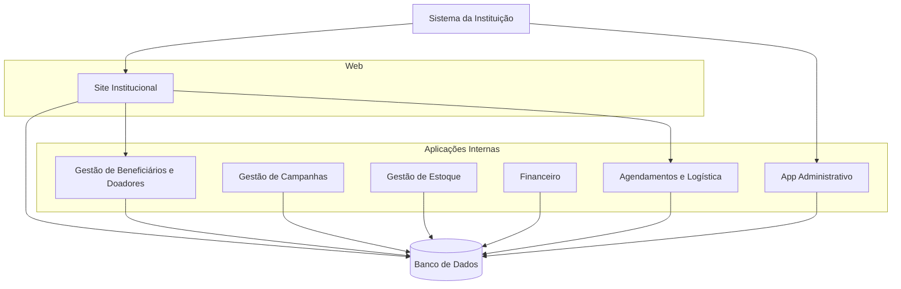

[Voltar ao início](#sumário)

### 3.6.3. Diagrama C4 de componente


O diagrama C4 de componente, terceiro nível da abordagem C4, é usado para detalhar a estrutura interna de um contêiner, mostrando os principais componentes (módulos, classes, serviços ou bibliotecas) que o compõem, suas responsabilidades e como eles se relacionam. Esse diagrama ajuda a compreender a organização lógica do código dentro de cada contêiner, facilitando a comunicação entre desenvolvedores e a tomada de decisões sobre design modular, reutilização e coesão. Ele é especialmente útil para orientar a implementação e manutenção de sistemas complexos, promovendo clareza na divisão de responsabilidades internas.


<!--
C4 Component diagram (C4Component)
-->

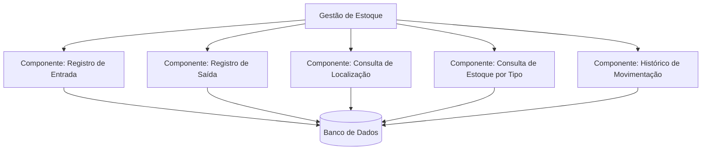

[Voltar ao início](#sumário)

### 3.6.4. Diagrama C4 de código


O diagrama C4 de código, quarto e mais detalhado nível da abordagem C4, serve para ilustrar a estrutura interna de um componente específico, normalmente focando em classes, métodos e suas relações em nível de código-fonte. Ele é útil para desenvolvedores que precisam entender com precisão como determinada funcionalidade está implementada, facilitando a leitura, manutenção e extensão do código. Embora o C4 enfatize que esse nível seja opcional e muitas vezes substituído por ferramentas automatizadas de documentação de código, ele pode ser valioso em contextos onde clareza e revisão técnica são essenciais.


<!--
C4 Deployment diagram (C4Deployment)
-->

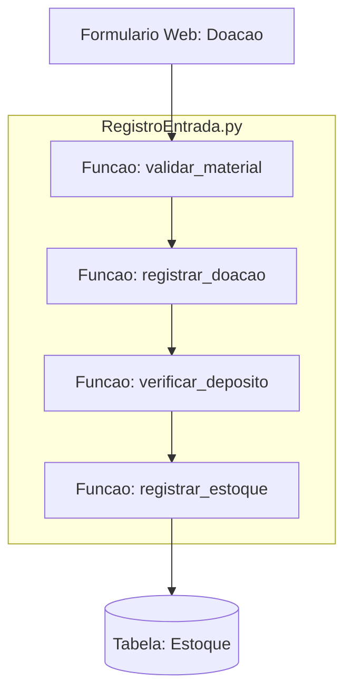

[Voltar ao início](#sumário)


## 4. Histórias de usuário


Histórias de usuários são descrições breves e informais dos requisitos do sistema escritas da perspectiva do usuário final, com o objetivo de capturar o que o usuário deseja fazer e por quê. Elas são amplamente utilizadas em metodologias ágeis, como Scrum e XP, para orientar o desenvolvimento centrado no valor entregue. Cada história segue geralmente o formato: “Como [tipo de usuário], eu quero [ação ou funcionalidade] para [benefício ou objetivo]”, permitindo que a equipe compreenda claramente o propósito da funcionalidade. Servem para facilitar a comunicação entre stakeholders e desenvolvedores, priorizar funcionalidades no backlog e guiar a construção de software de forma iterativa e incremental.


> [!TIP]
> Dica de Prompt...
Colocar as histórias de usuários no formato:
"Como um [tipo de usuário], eu quero [ação] para que [benefício].


🧑‍🤝‍🧑 Histórias de Usuário por Tipo
🧍 Pessoa Doadora
Como doador, eu quero cadastrar meus dados no site da instituição para que eu possa contribuir com doações de materiais de construção.

Como doador, eu quero registrar o tipo e a quantidade de material que estou doando para que a instituição possa organizar melhor o estoque.

Como doador, eu quero ser notificado quando o depósito estiver cheio para que eu possa guardar temporariamente os materiais.

Como doador, eu quero ver meu nome na lista pública de doadores para que eu possa acompanhar minha participação.

👩 Beneficiário
Como beneficiário, eu quero preencher um formulário no site para solicitar materiais de construção para que eu possa receber ajuda na reforma ou construção da minha casa.

Como beneficiário, eu quero agendar com antecedência a data e hora de entrega para que eu possa estar disponível para receber o material.

Como beneficiário, eu quero saber quais materiais estão disponíveis em estoque para que eu possa solicitar o que realmente está sendo ofertado.

Como beneficiário, eu quero enviar minha declaração de renda ou documento equivalente para que a instituição valide minha situação.

👨 Staff / Estagiário / Voluntário
Como voluntário, eu quero registrar novos doadores e beneficiários no sistema para que as ações sociais possam ser organizadas corretamente.

Como estagiário, eu quero registrar a entrada e saída de materiais no sistema de estoque para manter as informações atualizadas.

Como membro do staff, eu quero organizar campanhas com prazo e metas para que a instituição consiga arrecadar os materiais certos no tempo necessário.

Como membro do staff, eu quero acessar o regimento interno e horários de funcionamento para garantir o cumprimento das regras da instituição.

👩‍💼 Gerente Contábil
Como gerente contábil, eu quero controlar as contas a pagar e a receber da instituição para manter a saúde financeira da organização.

Como gerente contábil, eu quero registrar todas as movimentações financeiras no sistema para que os relatórios sejam confiáveis e auditáveis.

🌐 Visitante do Site
Como visitante do site, eu quero visualizar o calendário de doações e datas das assembleias para que eu possa participar ou colaborar com a instituição.

Como visitante do site, eu quero baixar o regimento interno e conhecer os beneficiários para entender melhor o funcionamento da instituição e seu impacto social.


[Voltar ao início](#sumário)

### 4.1. Organização de épicos e features


Épicos e features são formas de organizar e hierarquizar os requisitos de um sistema em metodologias ágeis. Um épico é uma narrativa de alto nível que descreve uma grande funcionalidade ou necessidade do usuário, abrangendo um conjunto de requisitos amplos que, geralmente, são complexos demais para serem desenvolvidos de uma só vez. Já as features são subconjuntos desses épicos, representando funcionalidades mais específicas que podem ser divididas em histórias de usuário menores e mais gerenciáveis. Ambos servem para estruturar o backlog do produto, facilitando o planejamento, o acompanhamento do progresso e o alinhamento entre as partes interessadas e a equipe de desenvolvimento.


#### 4.1.1. Épico 1: Gestão de Doadores
Objetivo: Permitir que cidadãos doem materiais com facilidade e controle

Features:

Cadastro de doadores via site

Registro de materiais doados

Consulta da situação do depósito (lotado ou não)

Lista pública de doadores no site

Agendamento de entrega pós-depósito cheio

[Voltar ao início](#sumário)

#### 4.1.2. Épico 2: Gestão de Beneficiários
Objetivo: Facilitar a solicitação e entrega de materiais para quem precisa

Features:

Formulário de solicitação de doações

Upload de documentação de renda

Consulta de estoque disponível

Agendamento de entrega de materiais

Visualização de status da solicitação

[Voltar ao início](#sumário)

#### 4.1.3. Épico 3: Operações Internas da Instituição
Objetivo: Organizar e manter o funcionamento do sistema da instituição

Features:

Registro interno de entrada/saída de materiais no estoque

Cadastro manual de doadores e beneficiários (por voluntários/staff)

Gerenciamento de campanhas (tipo, prazo, local, responsável)

Controle de veículos para logística

Acesso ao regimento interno e horários de funcionamento

[Voltar ao início](#sumário)


#### 4.1.4. Épico 4: Gestão Financeira
Objetivo: Garantir o controle contábil da instituição

Features:

Controle de contas a pagar

Controle de contas a receber

Geração de relatórios contábeis

Vinculação de movimentações a eventos ou campanhas

[Voltar ao início](#sumário)

#### 4.1.5. Épico 5: Transparência e Comunicação
Objetivo: Divulgar ações, regras e dados da instituição ao público

Features:

Calendário de doações no site

Divulgação das datas das assembleias

Página com regimento interno para download

Lista de beneficiários atendidos (parcial/pública)

Formulários de doação e solicitação acessíveis

[Voltar ao início](#sumário)

### 4.2. Jornada do usuário


A jornada do usuário é uma representação visual ou narrativa que descreve as etapas, interações e experiências que um usuário percorre ao utilizar um sistema, serviço ou produto para atingir um objetivo específico. Ela inclui pontos de contato, emoções, expectativas, dificuldades e decisões ao longo do caminho, oferecendo uma visão centrada no usuário. Essa ferramenta é essencial para entender o comportamento e as necessidades dos usuários, identificar oportunidades de melhoria na experiência e orientar o design de interfaces, funcionalidades e fluxos de uso mais eficientes e satisfatórios.


#### 4.2.1. Jornada do Usuário: Doador

| Etapa           | Ação                                               | Ponto de Contato       | Emoção Esperada | Oportunidade                                |
|------------------|----------------------------------------------------|--------------------------|------------------|----------------------------------------------|
| Descoberta      | Encontra o site da instituição                     | Site                    | Curioso, engajado | Mostrar impacto social da doação             |
| Cadastro        | Preenche formulário de doador                      | Formulário online       | Esperançoso      | Interface simples e responsiva               |
| Doação          | Registra tipo e quantidade de materiais            | Sistema Web             | Orgulhoso        | Feedback imediato sobre recebimento          |
| Entrega         | Aguarda agendamento ou guarda material temporariamente | Email / WhatsApp     | Confiante        | Notificação se depósito estiver cheio        |
| Reconhecimento  | Vê seu nome na lista de doadores                   | Página pública          | Valorizado       | Ranking ou certificado digital de doador     |

[Voltar ao início](#sumário)

#### 4.2.2. Jornada do Usuário: Beneficiári

| Etapa           | Ação                                               | Ponto de Contato       | Emoção Esperada | Oportunidade                                |
|------------------|----------------------------------------------------|--------------------------|------------------|----------------------------------------------|
| Descoberta      | Acessa o site da instituição                       | Navegador / Site        | Esperançoso      | Site acessível e inclusivo                   |
| Solicitação     | Preenche formulário e envia documentos             | Formulário online       | Ansioso          | Validação automática ou suporte remoto       |
| Acompanhamento  | Consulta status da solicitação                     | Painel ou email         | Impaciente       | Canal de comunicação direto com a equipe     |
| Agendamento     | Agenda a entrega dos materiais                     | Sistema de agendamento  | Aliviado         | Escolha de datas e veículos disponíveis      |
| Recebimento     | Recebe materiais em casa                           | Caminhão da instituição | Grato            | Avaliação de satisfação pós-serviço          |

[Voltar ao início](#sumário)

**Exemplos usando mermaid e journey**


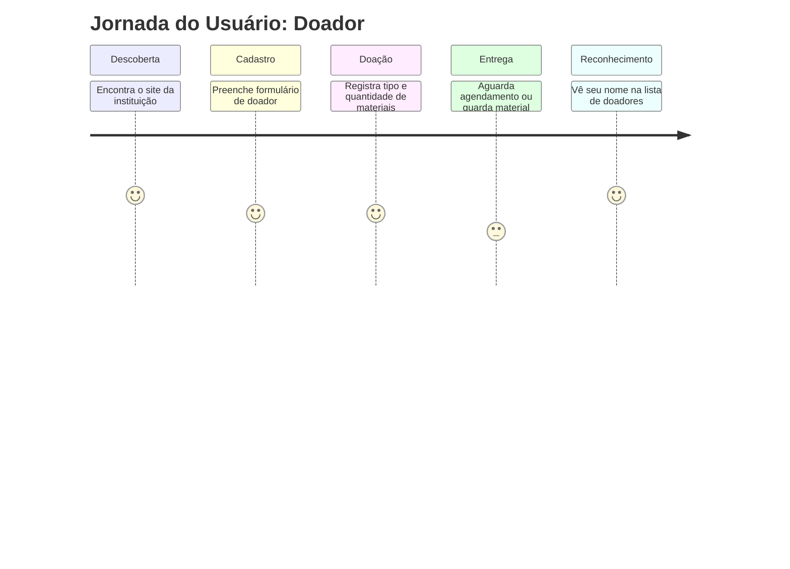

[Voltar ao início](#sumário)

**Exemplos **

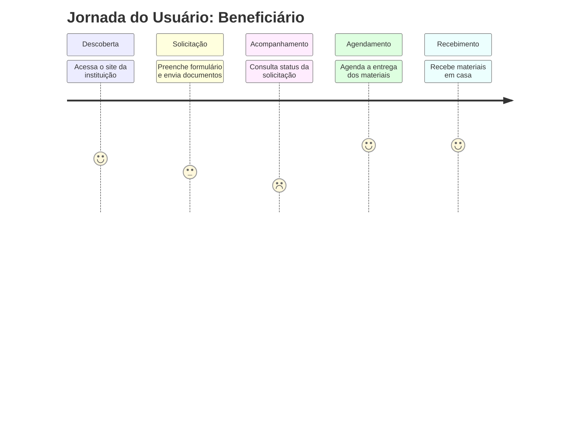

[Voltar ao início](#sumário)

## 5. Protótipo de telas


A prototipação de telas é o processo de criar representações visuais, interativas ou estáticas, da interface de um sistema antes do seu desenvolvimento completo, com o objetivo de validar conceitos, testar usabilidade e alinhar expectativas entre usuários, designers e desenvolvedores. Esses protótipos podem variar desde esboços simples (wireframes) até simulações mais realistas (protótipos de alta fidelidade) e servem para antecipar problemas de navegação, layout e funcionalidade. Assim, a prototipação ajuda a reduzir retrabalho, acelerar o desenvolvimento e garantir que o produto final atenda às necessidades reais dos usuários.


**Exemplo:**


> [!TIP]
> Dica de Prompt...

Prompt para criar telas:

Faça uma tela em html 5, css, php e javascript da seguinte forma:

usando python com (django) ou desktop usando qt ou tkinter

1. divida a tela em 3 partes:<br>
a primeira parte deverá ter o título da tela <br>
a segunda parte terá botões para operações crud <br>
a última parte terá os labels e campos <br>

a tela deverá mostrar um crud para a tabela descrita abaixo:

Idpet ---> int<br>
NomeDoPed --> varchar(100)<br>
Raça do pet --> varchat(50) <br>
.... listar os campos ....<br>

### 5.1. Exemplo de telas elaboradas via prompt

* Vamos supor que você é um especialista em Python e MySQ<br>
* Considere que você irá desenvolver interfaces gráficas com Python, com suporte ao português do Brasil <br>
* Você irá usar CustomTkinter<br>

Escreva um programa em python com CustomTkinter que faça o seguinte:

1. irá ler um arquivo de conexão (conexao.con) com o mysql contendo os seguintes dados
server='localhost';<br>
port='3306';<br>
database='eng_sw';<br>
user='';<br>
password='';<br>

2. haverá um form principal com um menu o menu terá as seguintes opções:
arquivo --> abrir grid alunos (grid_alunos)<br>
	--> abrir form aluno (form_alunos)<br>
gráficos -->idade dos alunos (form_idade_alunos)<br>
         --> quantidade de alunos (form_quantidade_alunos)<br>
relatórios --> impressão do form alunos (report_alunos) <br>
sair<br>
sobre --> form_sobre<br>
      --> form_licença<br>

3. O sistema deverá ser da seguinte fazer o seguinte: 

Leitura do arquivo de conexão (conexao.con)<br>
Formulário Principal com:<br>
	Menu → Arquivo, Gráficos, Relatórios, Sair, Sobre<br>
	Grid de Alunos (grid_alunos)<br>
	Formulário de Aluno (form_alunos)<br>
Gráficos:<br>
	Idade dos alunos (form_idade_alunos)<br>
	Quantidade de alunos (form_quantidade_alunos)<br>
Relatório de Alunos:<br>
	Impressão do formulário de alunos (report_alunos)<br>
Sobre e Licença:<br>
	Janela de informações sobre o sistema.<br>

4. Estrutura de pastas:

meu_app/<br>
│<br>
├── main.py<br>
├── conexao.con<br>
│<br>
├── model/<br>
│   └── conexao_db.py<br>
│<br>
├── controller/<br>
│   ├── aluno_controller.py<br>
│   ├── grafico_controller.py<br>
│   └── relatorio_controller.py<br>
│<br>
└── view/<br>
    ├── main_view.py<br>
    ├── grid_alunos.py<br>
    ├── form_alunos.py<br>
    ├── form_idade_alunos.py<br>
    ├── form_quantidade_alunos.py<br>
    ├── report_alunos.py<br>
    ├── form_sobre.py<br>
    └── form_licenca.py<br>


[Voltar ao início](#sumário)

## 6. Diagrama de navegação de tela


O diagrama de navegação de telas é uma representação visual que mostra como as diferentes telas ou páginas de um sistema estão conectadas, indicando os caminhos que o usuário pode seguir durante a interação com a interface. Ele serve para mapear o fluxo de navegação, facilitando o entendimento da estrutura do sistema, a lógica de transições e os pontos de entrada e saída das funcionalidades. Utilizado principalmente em projetos de software e design de interfaces, esse diagrama ajuda equipes de desenvolvimento e design a alinhar o comportamento esperado do sistema, garantindo uma experiência de usuário fluida e coerente.


> [!TIP]
> Dica de ferramenta: https://pencil-evolus-vn.translate.goog/?_x_tr_sl=en&_x_tr_tl=pt&_x_tr_hl=pt&_x_tr_pto=tc


[Voltar ao início](#sumário)

## 7. Pilha tecnológica


O diagrama de pilha tecnológica, ou descrição da pilha tecnológica, é uma representação organizada das tecnologias, linguagens de programação, frameworks, bancos de dados, serviços e ferramentas utilizadas no desenvolvimento e operação de um sistema. Ele serve para documentar a arquitetura técnica da solução, facilitando a comunicação entre equipes, a tomada de decisões sobre integrações, manutenções e evoluções do sistema. Ao visualizar a pilha tecnológica, é possível compreender como os diferentes componentes se encaixam, identificar dependências e garantir coerência entre as camadas de front-end, back-end, infraestrutura e serviços de suporte.


<!--

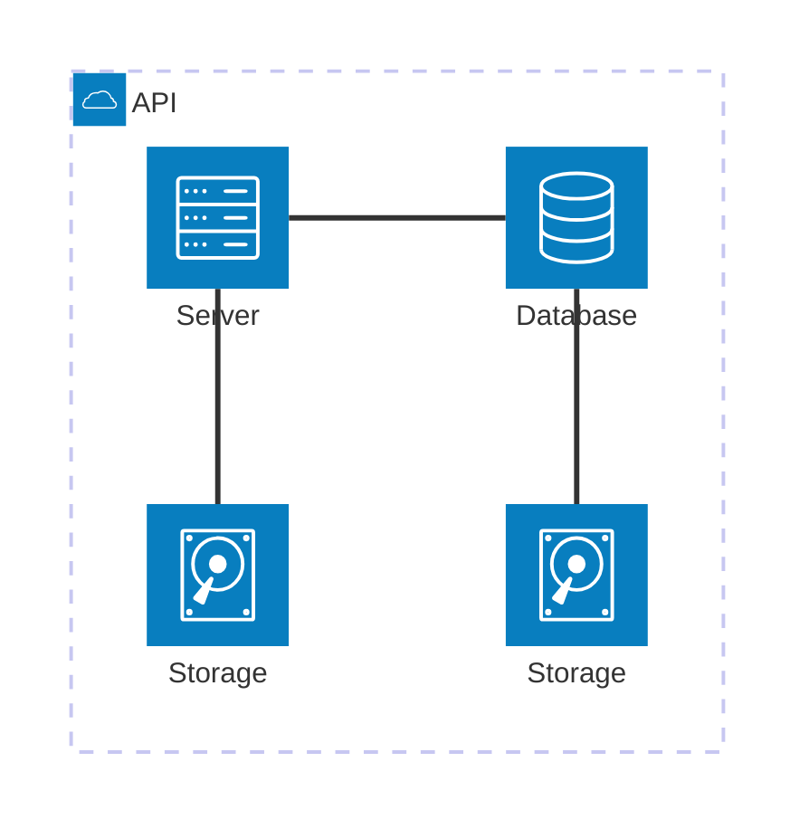
-->

[Voltar ao início](#sumário)

**Exemplo:**


## 8. Cronograma, Gráfico de Gantt


O gráfico de Gantt é uma ferramenta visual de gestão de projetos que representa o cronograma das atividades ao longo do tempo, utilizando barras horizontais para indicar a duração, o início e o fim de cada tarefa. Ele serve para planejar, acompanhar e controlar o progresso de um projeto, facilitando a visualização de dependências entre tarefas, prazos e marcos importantes. Amplamente utilizado por equipes de desenvolvimento, gerentes e stakeholders, o gráfico de Gantt permite identificar atrasos, ajustar prazos e garantir que todas as etapas do projeto sejam executadas dentro do cronograma estabelecido.


**Exemplo:**


[Voltar ao início](#sumário)


## 9. Estimativa de custos


Em um projeto de software, a tabela de estimativa de custos serve para prever e documentar os gastos necessários para o desenvolvimento, implantação e manutenção do sistema, abrangendo recursos humanos, infraestrutura, licenças, ferramentas, treinamentos e outros insumos. Essa tabela permite um planejamento financeiro mais preciso, facilita a tomada de decisões estratégicas, a negociação com stakeholders e o controle orçamentário ao longo do projeto. Além disso, ela ajuda a identificar possíveis excessos ou insuficiências de recursos, promovendo maior transparência e viabilidade econômica do projeto.


**Exemplo:**


[Voltar ao início](#sumário)

> [!TIP]
> Dica de Prompt...

Promtp para gráfico de gantt:

Leia o [Cronograma de desenvolvimento] abaixo: <br>
1 Analise de requisitos preliminar, de 05/05/2025 a 09/05/2025 <br>
2 Projeto básico, de 12/05/2025 a 16/05/2025 <br>
3 Detalhamento do projeto <br>

Faça unm gráfico de Gantt usando Mermaid e Markdown:

## 10. Anexos


Em um projeto de software, os scripts CREATE TABLE e INSERT com dados fictícios 
são utilizados nas fases iniciais de desenvolvimento para criar e popular um banco
de dados de teste, permitindo a validação da modelagem, a simulação de consultas
e a verificação do comportamento das funcionalidades que dependem de dados 
persistidos. Esses scripts ajudam analistas, desenvolvedores e testadores a 
identificar erros de estrutura, refinar requisitos e testar interfaces de forma
realista antes que dados reais estejam disponíveis. Além disso, ter tabelas no
banco com dados auxilia diretamente na prototipação de telas, pois permite 
que os desenvolvedores criem interfaces mais próximas da versão final, exibindo
informações reais e simulando interações com o sistema de forma consistente e funcional.


### 10.1. Script SQL

> [!TIP]
> Faça um Script SQL para MySQL, para o diagrama Mermaid acima:


```SQL

-- Criar tabela INSTITUICAO
CREATE TABLE INSTITUICAO (
    id INT AUTO_INCREMENT PRIMARY KEY,
    nome VARCHAR(255) NOT NULL,
    cnpj VARCHAR(14) NOT NULL,
    localizacao VARCHAR(255),
    cidade VARCHAR(255),
    regimentoInterno TEXT,
    horarioAtendimento VARCHAR(255)
);

-- Criar tabela DOACAO
CREATE TABLE DOACAO (
    id INT AUTO_INCREMENT PRIMARY KEY,
    tipoMaterial VARCHAR(255) NOT NULL,
    dataHora DATETIME NOT NULL,
    descricao TEXT,
    doador_id INT,
    FOREIGN KEY (doador_id) REFERENCES DOADOR(id)
);

-- Criar tabela DEPOSITO
CREATE TABLE DEPOSITO (
    id INT AUTO_INCREMENT PRIMARY KEY,
    tipoDeposito VARCHAR(255),
    estaCheio BOOLEAN NOT NULL,
    instituicao_id INT,
    FOREIGN KEY (instituicao_id) REFERENCES INSTITUICAO(id)
);

-- Criar tabela MATERIAL
CREATE TABLE MATERIAL (
    id INT AUTO_INCREMENT PRIMARY KEY,
    nome VARCHAR(255) NOT NULL,
    tipo VARCHAR(255) NOT NULL,
    quantidade DECIMAL(10, 2) NOT NULL
);

-- Criar tabela DOADOR
CREATE TABLE DOADOR (
    id INT AUTO_INCREMENT PRIMARY KEY,
    nome VARCHAR(255) NOT NULL,
    cpfCnpj VARCHAR(14) NOT NULL,
    endereco VARCHAR(255)
);

-- Criar tabela BENEFICIARIO
CREATE TABLE BENEFICIARIO (
    id INT AUTO_INCREMENT PRIMARY KEY,
    nome VARCHAR(255) NOT NULL,
    documentoIdentidade VARCHAR(255),
    endereco VARCHAR(255),
    tipoMaterialRecebido VARCHAR(255)
);

-- Criar tabela CONTROLE_ESTOQUE
CREATE TABLE CONTROLE_ESTOQUE (
    id INT AUTO_INCREMENT PRIMARY KEY,
    localArmazenamento VARCHAR(255) NOT NULL,
    dataHora DATETIME NOT NULL,
    material_id INT,
    doador_id INT,
    beneficiario_id INT,
    FOREIGN KEY (material_id) REFERENCES MATERIAL(id),
    FOREIGN KEY (doador_id) REFERENCES DOADOR(id),
    FOREIGN KEY (beneficiario_id) REFERENCES BENEFICIARIO(id)
);

-- Criar tabela VEICULO
CREATE TABLE VEICULO (
    id INT AUTO_INCREMENT PRIMARY KEY,
    modelo VARCHAR(255) NOT NULL,
    placa VARCHAR(20) NOT NULL
);

-- Relacionamento entre INSTITUICAO e DOACAO
CREATE TABLE INSTITUICAO_DOACAO (
    instituicao_id INT,
    doacao_id INT,
    PRIMARY KEY (instituicao_id, doacao_id),
    FOREIGN KEY (instituicao_id) REFERENCES INSTITUICAO(id),
    FOREIGN KEY (doacao_id) REFERENCES DOACAO(id)
);

-- Relacionamento entre INSTITUICAO e MATERIAL
CREATE TABLE INSTITUICAO_MATERIAL (
    instituicao_id INT,
    material_id INT,
    PRIMARY KEY (instituicao_id, material_id),
    FOREIGN KEY (instituicao_id) REFERENCES INSTITUICAO(id),
    FOREIGN KEY (material_id) REFERENCES MATERIAL(id)
);

-- Relacionamento entre INSTITUICAO e VEICULO
CREATE TABLE INSTITUICAO_VEICULO (
    instituicao_id INT,
    veiculo_id INT,
    PRIMARY KEY (instituicao_id, veiculo_id),
    FOREIGN KEY (instituicao_id) REFERENCES INSTITUICAO(id),
    FOREIGN KEY (veiculo_id) REFERENCES VEICULO(id)
);

-- Relacionamento entre INSTITUICAO e BENEFICIARIO
CREATE TABLE INSTITUICAO_BENEFICIARIO (
    instituicao_id INT,
    beneficiario_id INT,
    PRIMARY KEY (instituicao_id, beneficiario_id),
    FOREIGN KEY (instituicao_id) REFERENCES INSTITUICAO(id),
    FOREIGN KEY (beneficiario_id) REFERENCES BENEFICIARIO(id)
);

-- Relacionamento entre DOACAO e MATERIAL
CREATE TABLE DOACAO_MATERIAL (
    doacao_id INT,
    material_id INT,
    PRIMARY KEY (doacao_id, material_id),
    FOREIGN KEY (doacao_id) REFERENCES DOACAO(id),
    FOREIGN KEY (material_id) REFERENCES MATERIAL(id)
);

```

[Voltar ao início](#sumário)

### 10.2. Dados artificiais para testes de banco


> [!TIP]
> Faça um Script SQL para MySQL, usando os comandos Create table anteriores, para popular as tabelas do banco com pelo menos 5 registros ficticios


```SQL

-- Inserir dados na tabela INSTITUICAO
INSERT INTO INSTITUICAO (nome, cnpj, localizacao, cidade, regimentoInterno, horarioAtendimento)
VALUES
('Instituição A', '12345678000195', 'Rua A, 123', 'Cidade A', 'Regimento A', '14:00 - 18:00'),
('Instituição B', '98765432000156', 'Av. B, 456', 'Cidade B', 'Regimento B', '14:00 - 18:00'),
('Instituição C', '11122233000122', 'Rua C, 789', 'Cidade C', 'Regimento C', '14:00 - 18:00'),
('Instituição D', '22233344000133', 'Rua D, 321', 'Cidade D', 'Regimento D', '14:00 - 18:00'),
('Instituição E', '33344455000144', 'Av. E, 654', 'Cidade E', 'Regimento E', '14:00 - 18:00');

-- Inserir dados na tabela DOADOR
INSERT INTO DOADOR (nome, cpfCnpj, endereco)
VALUES
('Doador A', '12345678900', 'Rua do Doador A, 10'),
('Doador B', '98765432100', 'Rua do Doador B, 20'),
('Doador C', '45612378900', 'Rua do Doador C, 30'),
('Doador D', '32165498700', 'Rua do Doador D, 40'),
('Doador E', '65498732100', 'Rua do Doador E, 50');

-- Inserir dados na tabela MATERIAL
INSERT INTO MATERIAL (nome, tipo, quantidade)
VALUES
('Tijolo', 'Estrutura', 1000),
('Cimento', 'Estrutura', 500),
('Telha', 'Estrutura', 200),
('Areia', 'Estrutura', 300),
('Pedra', 'Estrutura', 400);

-- Inserir dados na tabela BENEFICIARIO
INSERT INTO BENEFICIARIO (nome, documentoIdentidade, endereco, tipoMaterialRecebido)
VALUES
('Beneficiário A', '1234567890', 'Rua Beneficiário A, 10', 'Tijolo'),
('Beneficiário B', '9876543210', 'Rua Beneficiário B, 20', 'Cimento'),
('Beneficiário C', '4561237890', 'Rua Beneficiário C, 30', 'Telha'),
('Beneficiário D', '3216549870', 'Rua Beneficiário D, 40', 'Areia'),
('Beneficiário E', '6549873210', 'Rua Beneficiário E, 50', 'Pedra');

-- Inserir dados na tabela VEICULO
INSERT INTO VEICULO (modelo, placa)
VALUES
('Caminhão', 'ABC-1234'),
('Pickup S10', 'DEF-5678'),
('Furgão', 'GHI-9012'),
('Van', 'JKL-3456'),
('Caminhão pequeno', 'MNO-7890');

-- Inserir dados na tabela DEPOSITO
INSERT INTO DEPOSITO (tipoDeposito, estaCheio, instituicao_id)
VALUES
('Depósito Principal', FALSE, 1),
('Depósito Temporário', FALSE, 1),
('Depósito Principal', TRUE, 2),
('Depósito Temporário', FALSE, 3),
('Depósito Principal', TRUE, 4);

-- Inserir dados na tabela CONTROLE_ESTOQUE
INSERT INTO CONTROLE_ESTOQUE (localArmazenamento, dataHora, material_id, doador_id, beneficiario_id)
VALUES
('Depósito Principal', '2025-03-25 14:00:00', 1, 1, 1),
('Depósito Temporário', '2025-03-25 15:00:00', 2, 2, 2),
('Depósito Principal', '2025-03-25 16:00:00', 3, 3, 3),
('Depósito Temporário', '2025-03-25 17:00:00', 4, 4, 4),
('Depósito Principal', '2025-03-25 18:00:00', 5, 5, 5);

-- Inserir dados na tabela DOACAO
INSERT INTO DOACAO (tipoMaterial, dataHora, descricao, doador_id)
VALUES
('Tijolo', '2025-03-25 10:00:00', 'Doação de tijolos para construção', 1),
('Cimento', '2025-03-25 11:00:00', 'Doação de cimento para construção', 2),
('Telha', '2025-03-25 12:00:00', 'Doação de telhas para construção', 3),
('Areia', '2025-03-25 13:00:00', 'Doação de areia para construção', 4),
('Pedra', '2025-03-25 14:00:00', 'Doação de pedras para construção', 5);

-- Relacionamento entre DOACAO e MATERIAL
INSERT INTO DOACAO_MATERIAL (doacao_id, material_id)
VALUES
(1, 1),
(2, 2),
(3, 3),
(4, 4),
(5, 5);

-- Relacionamento entre INSTITUICAO e DOACAO
INSERT INTO INSTITUICAO_DOACAO (instituicao_id, doacao_id)
VALUES
(1, 1),
(1, 2),
(2, 3),
(3, 4),
(4, 5);

-- Relacionamento entre INSTITUICAO e MATERIAL
INSERT INTO INSTITUICAO_MATERIAL (instituicao_id, material_id)
VALUES
(1, 1),
(1, 2),
(2, 3),
(3, 4),
(4, 5);

-- Relacionamento entre INSTITUICAO e VEICULO
INSERT INTO INSTITUICAO_VEICULO (instituicao_id, veiculo_id)
VALUES
(1, 1),
(2, 2),
(3, 3),
(4, 4),
(5, 5);

-- Relacionamento entre INSTITUICAO e BENEFICIARIO
INSERT INTO INSTITUICAO_BENEFICIARIO (instituicao_id, beneficiario_id)
VALUES
(1, 1),
(1, 2),
(2, 3),
(3, 4),
(4, 5);

```

[Voltar ao início](#sumário)

