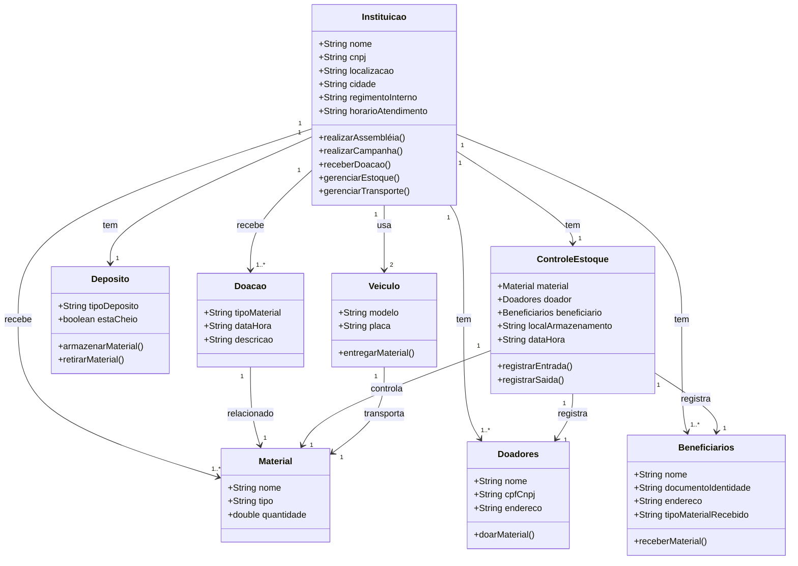
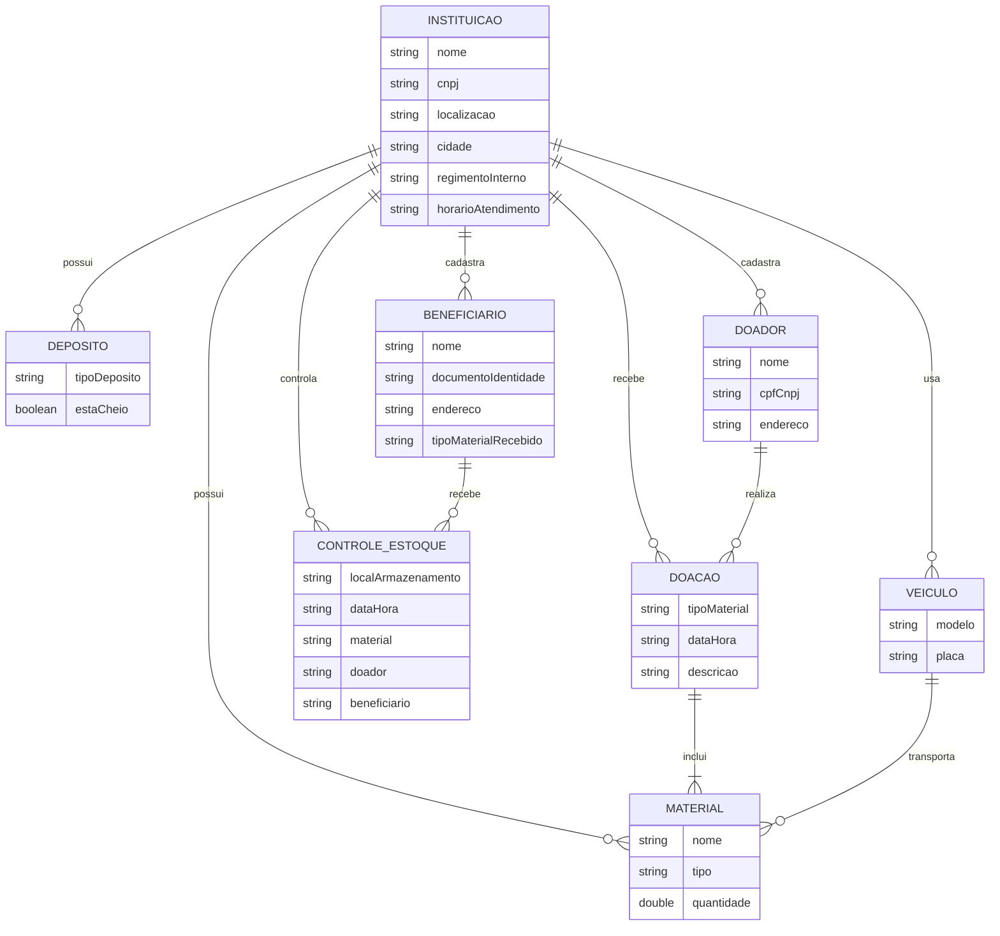

# sdmc
Sistema para Doação de Material de Construção (SDMC)

- [sdmc](#sdmc)
- [1. Introdução](#1-introdução)
- [2. Descrição](#2-descrição)
  - [2.1. Requisitos.](#21-requisitos)
  - [2.2. Funcionais e não-funcionais](#22-funcionais-e-não-funcionais)
- [3. Diagramas](#3-diagramas)
  - [3.1. Diagrama de classe](#31-diagrama-de-classe)
    - [digrama feito no white star (versão 1)](#digrama-feito-no-white-star-versão-1)
    - [3.1.1. Descrição do Diagrama de classe:](#311-descrição-do-diagrama-de-classe)
  - [3.2. Diagrama ER](#32-diagrama-er)
  - [3.3. Diagrama de casos de uso](#33-diagrama-de-casos-de-uso)
  - [3.3. Diagrama de atividade](#33-diagrama-de-atividade)
  - [3.4. Diagrama de componentes](#34-diagrama-de-componentes)
  - [3.5. Diagrama de implantação](#35-diagrama-de-implantação)
  - [4. Histórias de usuário](#4-histórias-de-usuário)
  - [5. Protótipo de telas](#5-protótipo-de-telas)
  - [6. Diagrama de navegação de tela](#6-diagrama-de-navegação-de-tela)
  - [Anexos](#anexos)
    - [A.1. Script SQL](#a1-script-sql)
    - [A.2. Dados artificiais para testes de banco](#a2-dados-artificiais-para-testes-de-banco)


# 1. Introdução

* Contexto: tarefa de casa...
* Motivação: tarefa de casa...

# 2. Descrição

Sistema para auxiliar no gerênciamento de uma instituição de caridade, que recebe doações de material de construção e direciona os mesmos para pessoas necessitadas previamente cadastradas.

## 2.1. Requisitos.

| Id | Requisitos |
|----|------------|
| 1  | Temos uma instituição sem fins lucrativos |
| 2  | A Instituição tem os seguintes atributos: nome, cnpj, localizaçao, cidade |
| 3 | A Instituição recebe Doação de Materias de construção |
| 4 | A Instituição tem um Depósito |
| 5 | A Instituição recebe Materiais do tipo: tijolo, cimento e telhas |
| 6 | A Instituição tem um Cadastro dos Materiais |
| 7 | A Instituição tem um Cadastro dos doadores |
| 8 | A Instituição tem um Cadastro dos Beneficiários |
| 9 | A Instituição tem um Depósito Temporário de Materiais de construção |
| 10 | A Instituição tem um banco de dados de Doadores, Materiais de construção e Beneficiários |
| 11 | A Instituição tem um pessoal de Staff, Estagiários e Voluntários; o Staff tem diretores e gerentes. |
| 12 | A Instituição tem um "contas a receber" e "contas a pagar", cuidado pela gerência contábil. |
| 13 | A Instituição tem um Regimento Interno (RI). |
| 14 | A Instituição atende apenas no horário da tarde, das 14hs as 18hs. |
| 15 | A Instituição recebe apenas Materais de construção usados na estrutura de casas, não recebe do tipo "materiais de interior" ou "materiais de acabamento". |
| 16 | A Instituição realiza uma Assembléia por ano, em março. |
| 17 | A Instituição realiza Campanhas com data, prazo, responsável e local previamente definidos|
| 18 | As Campanhas são para arrecadar determinados tipos de Materiais de construção como: telhas e tijolos. |
| 19 | Quando o depósito da Instituição esta cheio, os Materiais doados ficam com os Doadores temporariamente, até serem acionados para levar o Material ao Depósito da Instituição. |
| 20 | A Instituição tem um Controle de estoque indicando, qual Material entrou e quem fez a doação. |
| 21 | O controle de estoque indica onde esta armazenado temporariamente o Material até que sejam feita a destinação final deste. |
| 22 | O Controle de estoque também tem os dados de qual Beneficário recebeu os Materiais de contrução, em qual data e hora. |
| 23 | A Instituição tem um caminhão e uma pickup S10. |
| 24 | A Instituição usa o caminhão e a pickup para fazer entregas de materiais de construção, do depósito até os Beneficiários. |
| 25 | Uma ação de doação de Materiais de construção deve ter uma data e hora, previamente agendada com a equipe da Instituição e o Beneficiário. |
| 26 | A Instituição deverá ter um seu Site Institucional uma lista de doares, calendário de doação, datas de assembléis, redimento interno, lista de Beneficionários e formuláiros para os que desejarem doar ou receber materiais de construção. |
| 27 | O Beneficiário deverá apresentar declaração de rendimento ou outro documento equivalente que indique sua situação. |

## 2.2. Funcionais e não-funcionais

> [!TIP]
> Faça uma tabela usando Markdown, com duas colunas, uma coluna indicando o requisito e a outra coluna indicando o tipo de requisito (como "Funcional" ou "Não funcional"), para esta tarefa use a lista abaixo:


| Requisito                                                                                         | Tipo de Requisito |
|---------------------------------------------------------------------------------------------------|-------------------|
| Temos uma instituição sem fins lucrativos                                                        | Funcional         |
| A Instituição tem os seguintes atributos: nome, cnpj, localização, cidade                          | Funcional         |
| A Instituição recebe Doação de Materiais de construção                                            | Funcional         |
| A Instituição tem um Depósito                                                                     | Funcional         |
| A Instituição recebe Materiais do tipo: tijolo, cimento e telhas                                  | Funcional         |
| A Instituição tem um Cadastro dos Materiais                                                       | Funcional         |
| A Instituição tem um Cadastro dos doadores                                                        | Funcional         |
| A Instituição tem um Cadastro dos Beneficiários                                                   | Funcional         |
| A Instituição tem um Depósito Temporário de Materiais de construção                               | Funcional         |
| A Instituição tem um banco de dados de Doadores, Materiais de construção e Beneficiários           | Funcional         |
| A Instituição tem um pessoal de Staff, Estagiários e Voluntários; o Staff tem diretores e gerentes | Funcional         |
| A Instituição tem um "contas a receber" e "contas a pagar", cuidado pela gerência contábil        | Funcional         |
| A Instituição tem um Regimento Interno (RI).                                                      | Funcional         |
| A Instituição atende apenas no horário da tarde, das 14hs as 18hs                                 | Não Funcional     |
| A Instituição recebe apenas Materiais de construção usados na estrutura de casas, não recebe do tipo "materiais de interior" ou "materiais de acabamento" | Não Funcional     |
| A Instituição realiza uma Assembleia por ano, em março.                                           | Não Funcional     |
| A Instituição realiza Campanhas com data, prazo, responsável e local previamente definidos         | Funcional         |
| As Campanhas são para arrecadar determinados tipos de Materiais de construção como: telhas e tijolos | Funcional         |
| Quando o depósito da Instituição está cheio, os Materiais doados ficam com os Doadores temporariamente, até serem acionados para levar o Material ao Depósito da Instituição | Funcional         |
| A Instituição tem um Controle de estoque indicando, qual Material entrou e quem fez a doação      | Funcional         |
| O controle de estoque indica onde está armazenado temporariamente o Material até que sejam feita a destinação final deste | Funcional         |
| O Controle de estoque também tem os dados de qual Beneficiário recebeu os Materiais de construção, em qual data e hora | Funcional         |
| A Instituição tem um caminhão e uma pickup S10                                                   | Funcional         |
| A Instituição usa o caminhão e a pickup para fazer entregas de materiais de construção, do depósito até os Beneficiários | Funcional         |
| Uma ação de doação de Materiais de construção deve ter uma data e hora, previamente agendada com a equipe da Instituição e o Beneficiário | Funcional         |
| A Instituição deverá ter em seu Site Institucional uma lista de doadores, calendário de doação, datas de assembleias, regimento interno, lista de Beneficiários e formulários para os que desejarem doar ou receber materiais de construção | Funcional         |
| O Beneficiário deverá apresentar declaração de rendimento ou outro documento equivalente que indique sua situação | Não Funcional     |


# 3. Diagramas

## 3.1. Diagrama de classe

### digrama feito no white star (versão 1)


> [!TIP]
> Faça um diagrama de classe usando Markdown e Mermaid, para os requisitos abaixo:




### 3.1.1. Descrição do Diagrama de classe:

Instituicao é a classe principal, representando a entidade que administra a organização, que possui atributos como nome, CNPJ, localização, etc.

Doacao é a classe que representa as doações de materiais feitas para a instituição.

Deposito representa os depósitos (temporários e permanentes) de materiais.

Material armazena os diferentes tipos de materiais, como tijolos e telhas.

Doadores e Beneficiarios são as classes que representam as pessoas que doam e aquelas que recebem os materiais, respectivamente.

ControleEstoque é a classe que gerencia o controle do estoque, registrando entradas e saídas de materiais.

Veiculo refere-se aos veículos utilizados pela instituição para transportar materiais.

## 3.2. Diagrama ER


> [!TIP]
> Faça um diagrama de Entidade Relacionamento usando Markdown e Mermaid, para os requisitos abaixo:





## 3.3. Diagrama de casos de uso

> [!TIP]
> Faça um diagrama de Casos de Uso usando Markdown e PlantUML, para os requisitos abaixo:


@startuml
actor Doador
actor Beneficiario
actor GerenteContabil
actor Staff
actor Estagiario
actor Voluntario
actor Visitante
actor CaminhaoPickup

usecase "Cadastrar Material" as UC1
usecase "Cadastrar Doadores" as UC2
usecase "Cadastrar Beneficiarios" as UC3
usecase "Registrar Doacao" as UC4
usecase "Registrar Entrega de Materiais" as UC5
usecase "Agendar Doacao" as UC6
usecase "Consultar Estoque" as UC7
usecase "Gerenciar Contas a Receber" as UC8
usecase "Gerenciar Contas a Pagar" as UC9
usecase "Acompanhar Campanhas" as UC10
usecase "Organizar Assembleia" as UC11
usecase "Consultar Site Institucional" as UC12
usecase "Gerenciar Regimento Interno" as UC13
usecase "Cadastrar Caminhao ou Pickup" as UC14
usecase "Agendar Entrega" as UC15
usecase "Registrar Beneficiario" as UC16
usecase "Controle Estoque" as UC17
usecase "Registrar Doacao Temporaria" as UC18
usecase "Registrar Doacao Confirmada" as UC19

Doador --> UC2: "Doar Materiais"
Beneficiario --> UC3: "Cadastrar Beneficiário"
GerenteContabil --> UC8: "Gerenciar Contas a Receber"
GerenteContabil --> UC9: "Gerenciar Contas a Pagar"
Staff --> UC1: "Cadastrar Materiais"
Staff --> UC4: "Registrar Doação"
Staff --> UC5: "Registrar Entrega de Materiais"
Staff --> UC6: "Agendar Doação"
Staff --> UC7: "Consultar Estoque"
Staff --> UC10: "Acompanhar Campanhas"
Staff --> UC11: "Organizar Assembleia"
Staff --> UC13: "Gerenciar Regimento Interno"
Estagiario --> UC1: "Cadastrar Materiais"
Estagiario --> UC5: "Registrar Entrega de Materiais"
Estagiario --> UC6: "Agendar Doação"
Voluntario --> UC5: "Registrar Entrega de Materiais"
Voluntario --> UC7: "Consultar Estoque"
Visitante --> UC12: "Consultar Site Institucional"
CaminhaoPickup --> UC14: "Cadastrar Caminhão ou Pickup"
CaminhaoPickup --> UC15: "Agendar Entrega"
CaminhaoPickup --> UC17: "Controle Estoque"
Staff --> UC19: "Registrar Doação Confirmada"
Staff --> UC18: "Registrar Doação Temporária"

@enduml


incluir o digrama feito no white star


## 3.3. Diagrama de atividade

incluir o digrama feito no white star


## 3.4. Diagrama de componentes

## 3.5. Diagrama de implantação

## 4. Histórias de usuário

## 5. Protótipo de telas

## 6. Diagrama de navegação de tela

## Anexos

### A.1. Script SQL

> [!TIP]
> Faça um Script SQL para MySQL, para o diagrama Mermaid acima:


```SQL

-- Criar tabela INSTITUICAO
CREATE TABLE INSTITUICAO (
    id INT AUTO_INCREMENT PRIMARY KEY,
    nome VARCHAR(255) NOT NULL,
    cnpj VARCHAR(14) NOT NULL,
    localizacao VARCHAR(255),
    cidade VARCHAR(255),
    regimentoInterno TEXT,
    horarioAtendimento VARCHAR(255)
);

-- Criar tabela DOACAO
CREATE TABLE DOACAO (
    id INT AUTO_INCREMENT PRIMARY KEY,
    tipoMaterial VARCHAR(255) NOT NULL,
    dataHora DATETIME NOT NULL,
    descricao TEXT,
    doador_id INT,
    FOREIGN KEY (doador_id) REFERENCES DOADOR(id)
);

-- Criar tabela DEPOSITO
CREATE TABLE DEPOSITO (
    id INT AUTO_INCREMENT PRIMARY KEY,
    tipoDeposito VARCHAR(255),
    estaCheio BOOLEAN NOT NULL,
    instituicao_id INT,
    FOREIGN KEY (instituicao_id) REFERENCES INSTITUICAO(id)
);

-- Criar tabela MATERIAL
CREATE TABLE MATERIAL (
    id INT AUTO_INCREMENT PRIMARY KEY,
    nome VARCHAR(255) NOT NULL,
    tipo VARCHAR(255) NOT NULL,
    quantidade DECIMAL(10, 2) NOT NULL
);

-- Criar tabela DOADOR
CREATE TABLE DOADOR (
    id INT AUTO_INCREMENT PRIMARY KEY,
    nome VARCHAR(255) NOT NULL,
    cpfCnpj VARCHAR(14) NOT NULL,
    endereco VARCHAR(255)
);

-- Criar tabela BENEFICIARIO
CREATE TABLE BENEFICIARIO (
    id INT AUTO_INCREMENT PRIMARY KEY,
    nome VARCHAR(255) NOT NULL,
    documentoIdentidade VARCHAR(255),
    endereco VARCHAR(255),
    tipoMaterialRecebido VARCHAR(255)
);

-- Criar tabela CONTROLE_ESTOQUE
CREATE TABLE CONTROLE_ESTOQUE (
    id INT AUTO_INCREMENT PRIMARY KEY,
    localArmazenamento VARCHAR(255) NOT NULL,
    dataHora DATETIME NOT NULL,
    material_id INT,
    doador_id INT,
    beneficiario_id INT,
    FOREIGN KEY (material_id) REFERENCES MATERIAL(id),
    FOREIGN KEY (doador_id) REFERENCES DOADOR(id),
    FOREIGN KEY (beneficiario_id) REFERENCES BENEFICIARIO(id)
);

-- Criar tabela VEICULO
CREATE TABLE VEICULO (
    id INT AUTO_INCREMENT PRIMARY KEY,
    modelo VARCHAR(255) NOT NULL,
    placa VARCHAR(20) NOT NULL
);

-- Relacionamento entre INSTITUICAO e DOACAO
CREATE TABLE INSTITUICAO_DOACAO (
    instituicao_id INT,
    doacao_id INT,
    PRIMARY KEY (instituicao_id, doacao_id),
    FOREIGN KEY (instituicao_id) REFERENCES INSTITUICAO(id),
    FOREIGN KEY (doacao_id) REFERENCES DOACAO(id)
);

-- Relacionamento entre INSTITUICAO e MATERIAL
CREATE TABLE INSTITUICAO_MATERIAL (
    instituicao_id INT,
    material_id INT,
    PRIMARY KEY (instituicao_id, material_id),
    FOREIGN KEY (instituicao_id) REFERENCES INSTITUICAO(id),
    FOREIGN KEY (material_id) REFERENCES MATERIAL(id)
);

-- Relacionamento entre INSTITUICAO e VEICULO
CREATE TABLE INSTITUICAO_VEICULO (
    instituicao_id INT,
    veiculo_id INT,
    PRIMARY KEY (instituicao_id, veiculo_id),
    FOREIGN KEY (instituicao_id) REFERENCES INSTITUICAO(id),
    FOREIGN KEY (veiculo_id) REFERENCES VEICULO(id)
);

-- Relacionamento entre INSTITUICAO e BENEFICIARIO
CREATE TABLE INSTITUICAO_BENEFICIARIO (
    instituicao_id INT,
    beneficiario_id INT,
    PRIMARY KEY (instituicao_id, beneficiario_id),
    FOREIGN KEY (instituicao_id) REFERENCES INSTITUICAO(id),
    FOREIGN KEY (beneficiario_id) REFERENCES BENEFICIARIO(id)
);

-- Relacionamento entre DOACAO e MATERIAL
CREATE TABLE DOACAO_MATERIAL (
    doacao_id INT,
    material_id INT,
    PRIMARY KEY (doacao_id, material_id),
    FOREIGN KEY (doacao_id) REFERENCES DOACAO(id),
    FOREIGN KEY (material_id) REFERENCES MATERIAL(id)
);

```

### A.2. Dados artificiais para testes de banco


> [!TIP]
> Faça um Script SQL para MySQL, usando os comandos Create table anteriores, para popular as tabelas do banco com pelo menos 5 registros ficticios


```SQL

-- Inserir dados na tabela INSTITUICAO
INSERT INTO INSTITUICAO (nome, cnpj, localizacao, cidade, regimentoInterno, horarioAtendimento)
VALUES
('Instituição A', '12345678000195', 'Rua A, 123', 'Cidade A', 'Regimento A', '14:00 - 18:00'),
('Instituição B', '98765432000156', 'Av. B, 456', 'Cidade B', 'Regimento B', '14:00 - 18:00'),
('Instituição C', '11122233000122', 'Rua C, 789', 'Cidade C', 'Regimento C', '14:00 - 18:00'),
('Instituição D', '22233344000133', 'Rua D, 321', 'Cidade D', 'Regimento D', '14:00 - 18:00'),
('Instituição E', '33344455000144', 'Av. E, 654', 'Cidade E', 'Regimento E', '14:00 - 18:00');

-- Inserir dados na tabela DOADOR
INSERT INTO DOADOR (nome, cpfCnpj, endereco)
VALUES
('Doador A', '12345678900', 'Rua do Doador A, 10'),
('Doador B', '98765432100', 'Rua do Doador B, 20'),
('Doador C', '45612378900', 'Rua do Doador C, 30'),
('Doador D', '32165498700', 'Rua do Doador D, 40'),
('Doador E', '65498732100', 'Rua do Doador E, 50');

-- Inserir dados na tabela MATERIAL
INSERT INTO MATERIAL (nome, tipo, quantidade)
VALUES
('Tijolo', 'Estrutura', 1000),
('Cimento', 'Estrutura', 500),
('Telha', 'Estrutura', 200),
('Areia', 'Estrutura', 300),
('Pedra', 'Estrutura', 400);

-- Inserir dados na tabela BENEFICIARIO
INSERT INTO BENEFICIARIO (nome, documentoIdentidade, endereco, tipoMaterialRecebido)
VALUES
('Beneficiário A', '1234567890', 'Rua Beneficiário A, 10', 'Tijolo'),
('Beneficiário B', '9876543210', 'Rua Beneficiário B, 20', 'Cimento'),
('Beneficiário C', '4561237890', 'Rua Beneficiário C, 30', 'Telha'),
('Beneficiário D', '3216549870', 'Rua Beneficiário D, 40', 'Areia'),
('Beneficiário E', '6549873210', 'Rua Beneficiário E, 50', 'Pedra');

-- Inserir dados na tabela VEICULO
INSERT INTO VEICULO (modelo, placa)
VALUES
('Caminhão', 'ABC-1234'),
('Pickup S10', 'DEF-5678'),
('Furgão', 'GHI-9012'),
('Van', 'JKL-3456'),
('Caminhão pequeno', 'MNO-7890');

-- Inserir dados na tabela DEPOSITO
INSERT INTO DEPOSITO (tipoDeposito, estaCheio, instituicao_id)
VALUES
('Depósito Principal', FALSE, 1),
('Depósito Temporário', FALSE, 1),
('Depósito Principal', TRUE, 2),
('Depósito Temporário', FALSE, 3),
('Depósito Principal', TRUE, 4);

-- Inserir dados na tabela CONTROLE_ESTOQUE
INSERT INTO CONTROLE_ESTOQUE (localArmazenamento, dataHora, material_id, doador_id, beneficiario_id)
VALUES
('Depósito Principal', '2025-03-25 14:00:00', 1, 1, 1),
('Depósito Temporário', '2025-03-25 15:00:00', 2, 2, 2),
('Depósito Principal', '2025-03-25 16:00:00', 3, 3, 3),
('Depósito Temporário', '2025-03-25 17:00:00', 4, 4, 4),
('Depósito Principal', '2025-03-25 18:00:00', 5, 5, 5);

-- Inserir dados na tabela DOACAO
INSERT INTO DOACAO (tipoMaterial, dataHora, descricao, doador_id)
VALUES
('Tijolo', '2025-03-25 10:00:00', 'Doação de tijolos para construção', 1),
('Cimento', '2025-03-25 11:00:00', 'Doação de cimento para construção', 2),
('Telha', '2025-03-25 12:00:00', 'Doação de telhas para construção', 3),
('Areia', '2025-03-25 13:00:00', 'Doação de areia para construção', 4),
('Pedra', '2025-03-25 14:00:00', 'Doação de pedras para construção', 5);

-- Relacionamento entre DOACAO e MATERIAL
INSERT INTO DOACAO_MATERIAL (doacao_id, material_id)
VALUES
(1, 1),
(2, 2),
(3, 3),
(4, 4),
(5, 5);

-- Relacionamento entre INSTITUICAO e DOACAO
INSERT INTO INSTITUICAO_DOACAO (instituicao_id, doacao_id)
VALUES
(1, 1),
(1, 2),
(2, 3),
(3, 4),
(4, 5);

-- Relacionamento entre INSTITUICAO e MATERIAL
INSERT INTO INSTITUICAO_MATERIAL (instituicao_id, material_id)
VALUES
(1, 1),
(1, 2),
(2, 3),
(3, 4),
(4, 5);

-- Relacionamento entre INSTITUICAO e VEICULO
INSERT INTO INSTITUICAO_VEICULO (instituicao_id, veiculo_id)
VALUES
(1, 1),
(2, 2),
(3, 3),
(4, 4),
(5, 5);

-- Relacionamento entre INSTITUICAO e BENEFICIARIO
INSERT INTO INSTITUICAO_BENEFICIARIO (instituicao_id, beneficiario_id)
VALUES
(1, 1),
(1, 2),
(2, 3),
(3, 4),
(4, 5);

```

